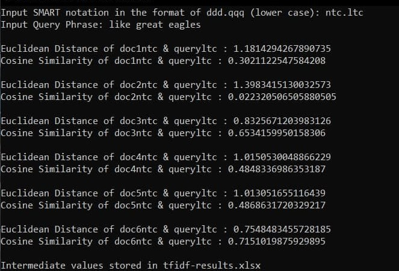

# CX4034 TF-IDF Generator
 Written for NTU CE4034/CZ4034 Information Retrieval. Tabulates tf-idf results based on typical tutorial/examination question formats.

## Introduction
This repository takes in terms, documents, its term frequencies, and a query, to produce the tf-idf values of each document, as well as the Cosine Similarity & Euclidean Distance to the query based on the SMART notation given. The SMART features implemented in this script is limited to those that are covered in CX4034 . They are:

| Term Frequency| Doc Frequency | Normalisation |  
| ------------- | ------------- | ------------- | 
| n: natural  	| n: natural  	| n: natural 	|
| l: logarithmic| t: inversed doc freq | c: cosine normalisation | 
| a: augmented  ||| 

Feel free to implement your own features should you require to.

## Usage
Before you begin, ensure that you have pandas & numpy installed on your python environment. If you do not, execute `pip install -r requirements.txt`. There is two ways for you to run the script; 1) Directly through `.py` file, or 2) Through Jupyter Notebook.

### Steps
1) Input your documents & term frequencies in `tfidf-input.xlsx`. Please do not stray from the existing format.
2) Execute `python tfidfgen.py`, or open `tfidfgen.ipynb` on Jupyter Notebook and run the cells in order. 
3) You will be prompted to input the SMART notation (i.e. ntc.atc).
4) You will be prompted to input the query. Note that if query contain terms that does not exist within `tfidf-input.xlsx`, a WARNING will be printed.
5) Cosine Similarity & Euclidean Distance will be printed, and the tf-idf values will be exported to `tfidf-results.xlsx`

### Example Results
There are example values `tfidf-input.xlsx` and `tfidf-results.xlsx`, based on AY1819 Semester 2 Examination Question.

### Remarks
1) I understand the code is not the cleanest, neither is it optimised, it was a pet project written in 1 day so please be forgiving.
2) For Term Frequency (Logarithmic), some PYP uses `1+log(tf)` while others use `log(tf+1)`. You may switch between either by uncommenting and commenting the appropriate lines in `if tfnotation =='l':` case inside `tfCalc()` function. 